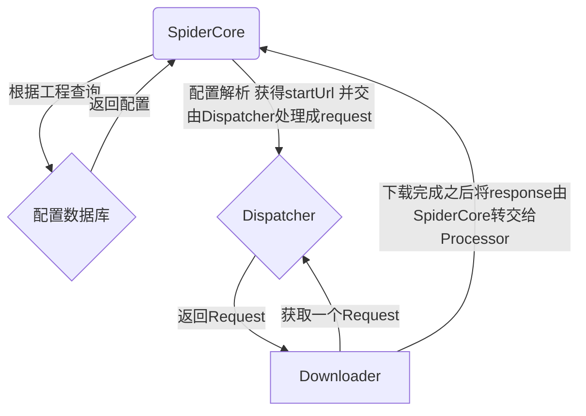

# SimpleSpider

It is designed to generate crawler configuration,
and capture data by program through simple operation on some websites with obvious rules easily,
After success data will be processed and analyzed, storage and export can be carried out

旨在对部分拥有明显规律的网站进行简单的操作就可以轻松的生成爬虫配置并通过程序抓取数据
在成功数据之后对数据进行处理，分析，存储导出等操作(不要吐槽我的塑料英语)

---------

@Create Time: 2021/11/17 23:17:05

@Author: sukeban

@Email: 1052700448@qq.com

---------

### module

1. SpiderConfig
   1. 爬虫设置
      1. 分为全局设置,工程设置,单个爬虫的设置
      2. 从左到右优先级递增
   2. 爬虫工程的配置
      1. 控制整个爬虫工程的流程和内容提取结果,以及数据的梳理方式
      2. SpiderConfig经SpiderCore交由爬虫核心解析和运用
2. SpiderCore
   1. 框架核心,根据SpiderConfig协调各组件(包括中间件)之间的运行
3. Dispatcher
   1. 根据SpiderCore 传达的URL(分为初始URL以及后续获取到的) 生成Request 并加入下载队列
4. Downloader
   1. 向调度器请求一个通过下载中间件的Request 
   2. 成功之后返回一个通过中间件(也可以不经过)的Response 最后交给SpiderCore
5. Processor
   1. 从SpiderCore获取SpiderConfig根据配置解析内容或者要继续跟进的URL
      1. 根据SpiderConfig的配置规则来提取内容和链接
         1. 配置规则包含rule以及中间件列表
         2. 流程为Downloader --> middlewares -->解析器  
      2. 解析出来的内容 放到Item中存储 并由SpiderCore转交给Pipeline
      3. 如果解析出需要跟进的URL则由SpiderCore转交给Dispatcher继续跟进
6. Pipeline
   1. SpiderCore将数据处理配置和Item传入Pipeline
      1. Pipeline根据配置处理Item
         1. 清理
         2. 验证
         3. 持久化等操作
7. Api
   1. GUI以及远程控制的api
8. GUI
   1. 可视化爬虫工程配置，操作,监控界面

# 设计思路

----

### `SpiderConfig` 来提供爬虫工程的配置，配置存放在数据库中存储

TODO

1. **工程配置**的数据结构
   1. 公共配置(大多数情况下通用的)
   2. 自定义配置
2. 配置`配置解析器`的运作方式
3. `爬虫核心`的运作方式（怎么支持从配置决定流程）
   1. 中间件支持
4. `内容提取器`的运作方式
   1. 中间件支持
5. `数据清洗器`的运作方式
   1. 中间件支持
6. `中间件`扩展接口规范`中间件调度器`
   1. 由一个`中间件调度器`来调度`中间件`和`原生组件`运行

----

### `SpiderCore` 根据流程配置执行爬虫的