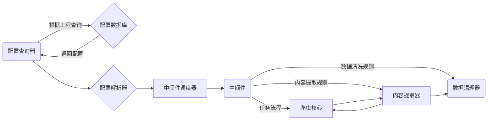

# SimpleSpider

It is designed to generate crawler configuration,
and capture data by program through simple operation on some websites with obvious rules easily,
After success data will be processed and analyzed, storage and export can be carried out

旨在对部分拥有明显规律的网站进行简单的操作就可以轻松的生成爬虫配置并通过程序抓取数据
在成功数据之后对数据进行处理，分析，存储导出等操作(不要吐槽我的塑料英语)

---------

@Create Time: 2021/11/17 23:17:05

@Author: sukeban

@Email: 1052700448@qq.com

---------

### module

1. SpiderConfig
    1. 爬虫工程的配置控制整个爬虫工程的流程和内容提取结果,以及数据的梳理方式
2. Database
    1. 数据以及工程配置的存储
3. SpiderCore
   1. 爬虫核心 内容下载, 使用中间件处理内容 
4. MiddlewareDispatcher
    2. 中间件调度器，来调度中间件与原生组件运行
        1. 原生组件指爬虫核心，数据提取器，数据清洗器
5. DataParse
    1. 数据的提取解析
6. DataCarding
    1. 数据的清洗
7. Api
    1. GUI以及远程控制的api
8. GUI
    1. 可视化爬虫工程配置，操作,监控界面

# 设计思路

----

### `SpiderConfig` 来提供爬虫工程的配置，配置存放在数据库中存储

1. **工程配置**存储在`配置数据库`中
2. 程序通过`配置查询器`取得配置
3. **工程配置**通过`配置解析器`决定爬虫流程，内容的提取规则，以及数据的清洗规则， 以及使用了哪些`中间件`
4. **工程配置**传入`中间件调度器`，根据**中间件配置**来调度所需的`中间件`和`原生组件`
5. `爬虫核心`根据**工程配置**爬取数据
    1. 流程必须要可扩展
        1. 比如怎么提取链接（是否翻页， 是否滚动）
        2. 流程中可以添加其他的功能
        3. 以上两点个人认为应该有`中间件`来实现，所以才称为扩展
    2. 从h5源码提取内容 或者是从xhr中抓包数据

TODO
1. **工程配置**的数据结构
   1. 公共配置(大多数情况下通用的)
   2. 自定义配置
2. 配置`配置解析器`的运作方式
3. `爬虫核心`的运作方式（怎么支持从配置决定流程）
    1. 中间件支持
4. `内容提取器`的运作方式
    1. 中间件支持
5. `数据清洗器`的运作方式
    1. 中间件支持
6. `中间件`扩展接口规范`中间件调度器`
    1. 由一个`中间件调度器`来调度`中间件`和`原生组件`运行

----

### `SpiderCore` 根据流程配置执行爬虫的