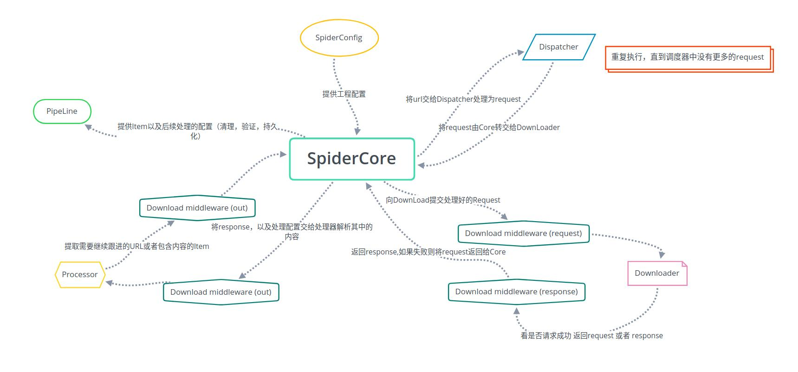

# SimpleSpider

It is designed to generate crawler configuration,
and capture data by program through simple operation on some websites with obvious rules easily,
After success data will be processed and analyzed, storage and export can be carried out

旨在对部分拥有明显规律的网站进行简单的操作就可以轻松的生成爬虫配置并通过程序抓取数据
在成功数据之后对数据进行处理，分析，存储导出等操作(不要吐槽我的塑料英语)

---------

@Create Time: 2021/11/17 23:17:05

@Author: sukeban

@Email: 1052700448@qq.com

---------

### module

1. **SpiderConfig**
    1. 爬虫设置
        1. 分为全局设置,工程设置,单个爬虫的设置
        2. 从左到右优先级递增
    2. 爬虫工程的配置
        1. 控制整个爬虫工程的流程和内容提取结果,以及数据的梳理方式
        2. `SpiderConfig`经`SpiderCore`交由`Processor`解析和运用
2. **SpiderCore**
    1. 框架核心,根据`SpiderConfig`协调各组件(包括`中间件`)之间的运行
3. **SpiderDispatcher**
    1. 根据`SpiderCore` 传达的`URL`(分为`初始URL`以及后续获取到需要继续跟进的) 生成`Request` `排重`后加入队列
4. **Downloader**
    1. `SpiderCore`分配一个通过`下载中间件(request方向)`的`Request`给`DownLoader`
    2. 请求成功之后返回一个通过`下载中间件(response方向)`的`Response` 最后交给`SpiderCore`，请求失败则返回`Request`
    3. 只有配置中设定了要使用的`中间件`才会通过`中间件`通讯，其他情况直接和`DownLoader`交互
5. **Processor**
    1. 从`SpiderCore`获取`SpiderConfig`根据配置解析内容或者要继续跟进的URL
        1. 根据`SpiderConfig`的配置规则来提取内容和链接
            1. 配置规则包含`rule`以及中间件列表
            2. 流程为`Downloader` --> `middlewares` --> `Processor`
        2. 解析出来的内容 放到`Item`中存储 并由`SpiderCore`转交给`Pipeline`
        3. 如果解析出需要跟进的`URL`则由`SpiderCore`转交给`SpiderDispatcher`继续跟进
6. **Pipeline**
    1. `SpiderCore`将数据处理配置和`Item`传入`Pipeline`
    2. ` Pipeline`根据配置处理`Item`
       1. 清理
       9. 验证
       10. 持久化等操作
11. **Api**
     1. GUI以及远程控制的api
12. **GUI**
     1. 可视化爬虫工程配置，操作,监控界面

# 设计思路

----

### `SpiderConfig` 来提供爬虫工程的配置，配置存放在数据库中存储

----

### `SpiderCore` 根据流程配置执行爬虫的

zz
