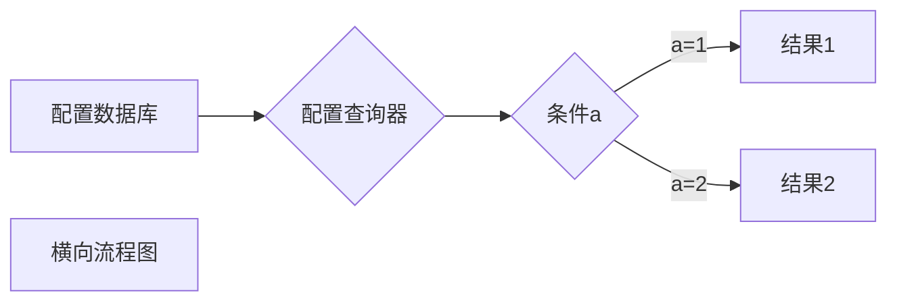

# SimpleSpider    
A crawler that allows anyone to simply crawl data from a web page

---------

@Create Time: 2021/11/17 23:17:05
@Author: sukeban 
@Email: 1052700448@qq.com

---------

### module

1. spider_config_core
2. database
3. spider_url_core
4. spider_content_core
5. GUI
   

整个程序的设计思路为 

spider_config_core 来提供爬虫的爬取规则，规则存放在数据库中存储

1. 配置存储在配置数据库中
2. 程序通过配置查询器取得配置
3. 配置通过解析器决定爬虫流程，以及分解为具体的匹配规则
   1. 配置决定程序流程这个设计有很多实现方式
   2. 匹配规则可以有如下几种
      1. 正则表达式
      2. X-Path
      3. beautiful soup
      4. PyQuery

